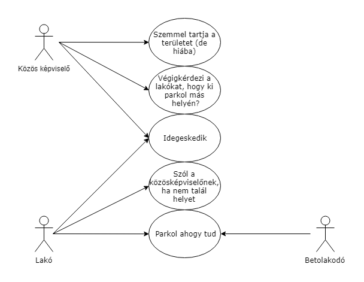
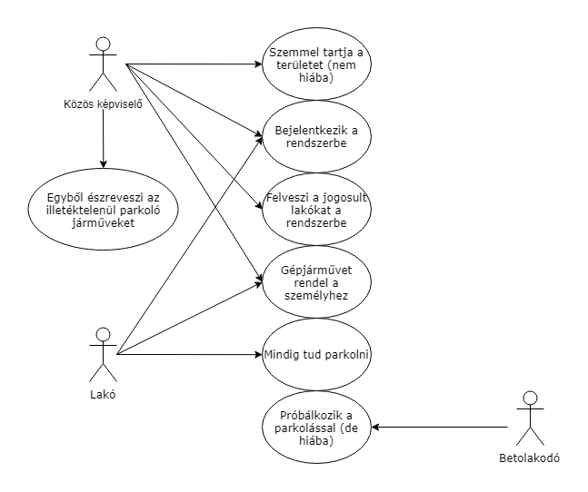

## 1. Áttekintés

A fejlesztendő rendszer célja egy bővebb lakóközösség (lépcsőház) közös képviselőjének a munkáját könnyítené meg. Az illetőnek rengeteg bosszúságot okoz,
 hogy a lakás tulajdonosok, bérlőik és vendégeik különböző gépjárművekkel jelennek meg a társasház udvarán, átláthatatlan állapotokat generálva. Rend a lelke mindennek,
 így hát a parkolási rendet is be kell tartania mindenkinek. Az nem lehet, hogy valaki orvul elfoglalja más tisztességes lakó helyét. Itt bizony csak egy regisztrációs
 rendszer segíthet, ahol az arra illetékesek beregisztrálhatják gépjárműveiket, amikkel az udvaron lévő parkolóhelyeken meg szeretnének állni.

## 2. Jelenlegi helyzet
A jelenlegi helyzet kaotikus. A Budapest 6. kerületi Bajza utca 62. szám alatti társasház udvarára boldog-boldogtalan beáll az aktuális gépjárműjével, ami teljességgel
ellentmond a közösség érdekének, mivel a lakók nem mindig tudnak beállni a számukra fenntartott helyre, ha valaki beáll oda. Ez sok konfliktushoz vezet.
A mai világban, amikor már nem mindenki ismeri a szomszédját, a társasház egyes lakásaiban bérlők laknak, igazán kényelmetlen tud lenni, ha az ott parkoló ismeretlen autó
tulajdonosát fel kell kutatni. Jelenleg nincs számontartva, hogy melyik lakóhoz melyik gépjárművek tartoznak, így csak akkor lehet fellépni, ha már kialakult a baj, vagyis
egy lakó (akit jogosan illeti a lakásához tartozó parkírozó hely) nem tud leparkolni. Ilyenkor aztán a közös képviselő az összes lakót egyesével otthonában felkeresi
és az ismeretlen jármű tulajdonviszonyairól kérdezi őket. Ha megvan a parkolóhelyet bitorló személy, azt felszólítja az udvarról való távozásra.

## 3. Vágyálom rendszer
**3.1. Hatáskör - felhasználók**

A belépésre jogosultakat a mindenkori közös képviselő jelölné ki, a kezdeti felhasználóneveket és jelszavakat is tőle kaphatnák.

**3.2. Funkciók**

Bejelentkezés után a felhasználók (az adott ház lakói)
- megváltoztathatják a jelszavukat
- felvehetnek a nevükhöz új gépjárműveket
- a gépjárművek adatait kellőképpen részletesen lehessen megadni, hogy beazonosításuk sikeres lehessen
- a gépjárművek (gépkocsi, motorkerékpár) mellett megadható legyen, hogy melyik lakáshoz tartozik a felhasználó

**3.3. Indulás, jövőbeni fejlesztések, távlatok**

Az alap szoftver, amire mindenképp szükség lenne, az azt teszi lehetővé, hogy a személyek és gépjárművek megfelelő módon,
rögzítésre kerülhessenek és az illetékes személy megtekinthesse a nyílvántartást.
A későbbiekben jó lenne, ha a közös képviselő rögzíthetné, hogy kinek a hibájából történt esetleg fennakadás.
Lehetőség lenne a jövőben új funkciókat beiktatni, ha van rá igény. Kiterjeszthető lenne a rendszer a lépcsőház takarítási rendjére,
a pincében lévő tárolók használatára vagy egyéb közérdekű információk tárolására.

## 4. Rendszerre vonatkozó törvények, szabványok, ajánlások
**4.1. Szerzői jogszabályok:**
- A törvény szerint az eredeti számítógépes program az azt létrehozó személy vagy vállalat szellemi tulajdona. A számítógépes programokat szerzői jogi törvény védi, amely kimondja, hogy az ilyen művek engedély nélküli másolása törvénybe ütköző cselekedet. (Magyarországon a szerzői jogokat az 1999. évi LXXVI. törvény szabályozza)
- Licenszerződés(amennyiben van)

## 5. Jelenlegi üzleti folyamatok modellje

## 6. Igényelt üzleti folyamatok

## 7. Követelmény Lista
  - Mindenki számára elérhető regisztrációs felület.
  - Adatok frissítése/törlése egyszerűen.
  - Platform független.
  - Listázás lehetősége.
  - Logok készítése. 
## 8. Riportok

## 9. Fogalomszótár
