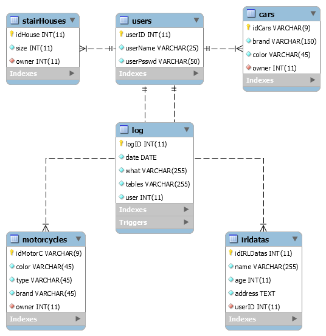

# Rendszerspecifikáció

A követelményspecifikációban megfogalmazott feladatok elkészítés több ütemben készül el.
Az ütemterv első része az alábbiakat tartalmazza.	

## A rendszerrel szemben támasztott általános követelmények
	- Adatbázis használata.
	- Bármilyen szintű hozzáférés a rendszerhez csak is bejelentkezés után.
	- Logolás lehetősége.

## Az alkalmazásokkal szemben támasztott funkcionális követelmények
	- Grafikus felület.
	- Távoli hozzáférés.
	- Listázás.

## Funkcionális követelmények
	- Bejelentkezés
	- CRUD műveletek
	- Adatbázis elérése
	- Listázás
		
		
		

## Felülettel szemben támasztott követelmények
	- Adatok felvitele táblázatba
	- Adatok rögzítése MySQL adatbázisba
	- Adatok listázása

**Tesztanyagok:**

	
x - Adatvédelem
x - Hardver elemekkel kapcsolatos követelmények

--------------------------------------

## Adatbázis terv
	- EER diagram:

		

